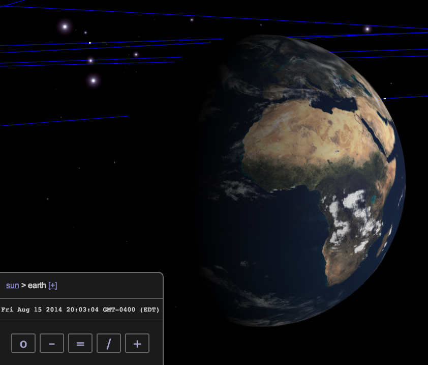

# Celestiary

Inspired by Celestia (http://shatters.net/celestia), Celestiary is a
web-based astronomical dataset explorer, backed by a data wiki for
community maintenance of the celestial datasets.

A running instance of Celestiary is available at:

http://celestiary.appspot.com/

## TODO
v1:
- Smooth transitions.
- Exponential zoom.
X Time control.
X Units for measurements.
- Q/A against Celestia.
  - Epoch-based locations.
v2:
- Stars and Galaxies.
- LRU scene-graph un-loading.
X View options, e.g. toggle orbits.
- Time slider.  Meaningful time steps: 1s, 1m, 1h, 1d, 1mo, 1yr, ...

## How to Build

