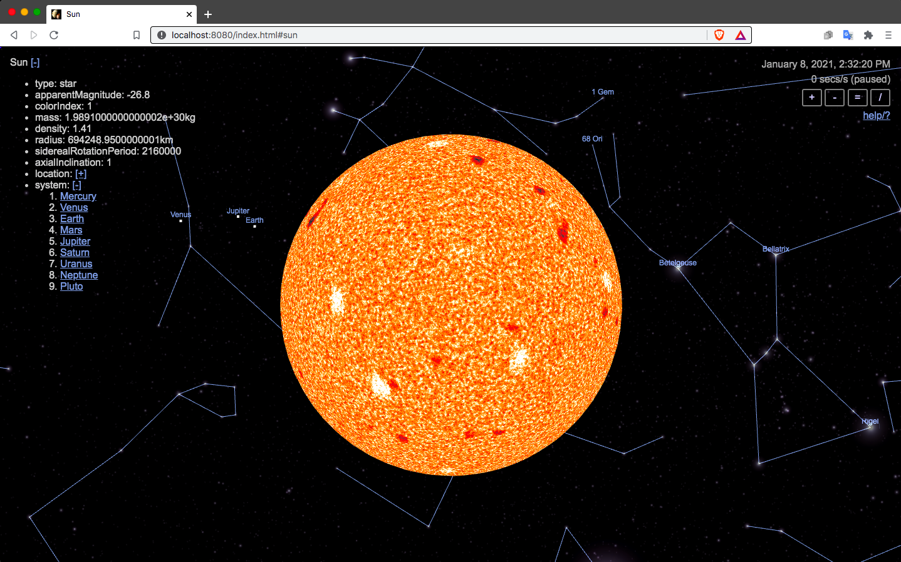

# Celestiary


A celestial simulator inspired by Celestia
(http://shatters.net/celestia), written in JS/three.js/GLSL.

A running instance of Celestiary is available at:

https://pablo-mayrgundter.github.io/celestiary/


## Features
- Keplerian orbits (6 orbital elements)
- Time controls, to alter rate and direction of time
- Star colors based on surface temperatures
- Star surface dynamics simulation (Perlin noise in black-body spectra)
- 9 planets, 20 moons
- Permalinks for positions

Celestia datasets:
- ~100,000 stars
- ~3k star names
- ~80 Asterisms/constellations

See open issues page for upcoming features: https://github.com/pablo-mayrgundter/celestiary/issues 

## How to run locally

Run a web server in the root directory and load index.html from there.
The project includes https://github.com/pablo-mayrgundter/http, e.g.:

```
> git clone --recurse-submodules https://github.com/pablo-mayrgundter/celestiary
> java/http/net/http/serve.sh
net.http.Server.port=8080
net.http.Server.log=true
net.http.Server.index=index.html
net.http.Server.ssl=false
...
```
Alternatively with Node's http-server package:
```
> npx http-server -p 8080
Starting up http-server, serving ./
Available on:
  http://127.0.0.1:8080
  http://10.0.0.3:8080
Hit CTRL-C to stop the server
```

Now visit http://localhost:8080/index.html in your browser

## Build

No build is required, but for efficiency the live site uses a JS bundle, created like this:

```
~/celestiary/> cd js
~/celestiary/js> npx rollup index.js --file bundle.js

index.js → bundle.js...
created bundle.js in 2.4s
```

The bundle.js file is referenced only in index.html in the script include.  Switch that to js/index.js for live source editing.

## Test

There are a few tests in files ending in: _test.js
```
~/celestiary/js> for f in *_test.mjs ; do echo $f ; node $f ; done
AsterismsCatalog_test.mjs
TOTAL OK: 1, FAIL: 0, ASSERTS: 2
StarsCatalog_test.mjs
TOTAL OK: 3, FAIL: 0, ASSERTS: 3
```
