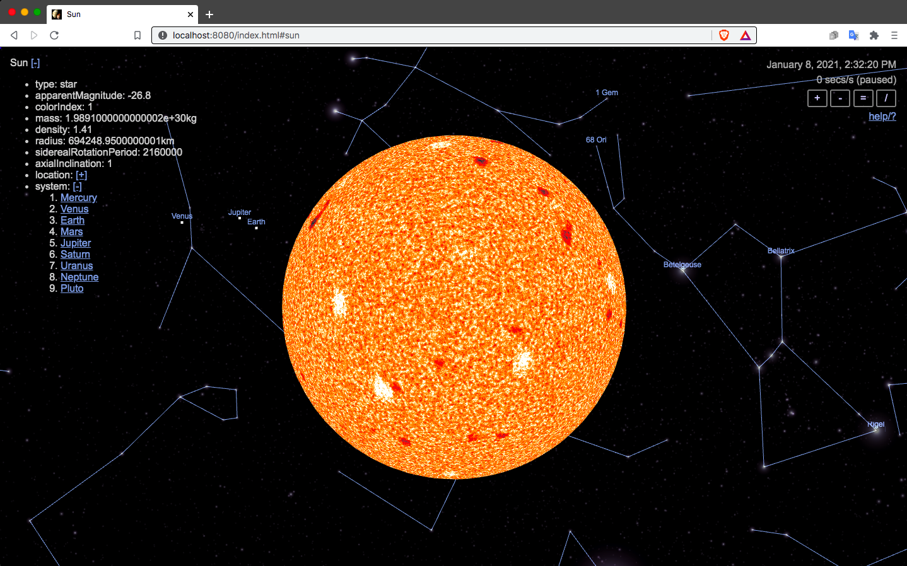

# Celestiary


A celestial simulator inspired by Celestia
(http://shatters.net/celestia), written in JS/three.js/GLSL.

A running instance of Celestiary is available at:

https://celestiary.github.io/

## Features
- 9 planets, 20 moons. Accurate major planet orbits
- 106,747 stars, 5,672 names
- 89 constellations
- Time controls for rate and direction of time
- Kinda works on mobile! :)

See [open issues](https://github.com/celestiary/celestiary/issues) page for upcoming features.

## Design

See [DESIGN.md](DESIGN.md)

## Development
```
yarn install
yarn test
yarn serve
# Visit http://localhost:8080/
```

Edits in the source directory will be available in the app on a page refresh.

For larger changes, it's also a good idea to step through the guide pages (in /guide) to make sure they'll all working.

## Deploy
The app is served at https://celestiary.github.io/ (user page, short URL) and
https://celestiary.github.io/web/ (project page).  Both deploy automatically
on push to `main` from this repo:

- `.github/workflows/gh-pages.yml` builds with `BASE_PATH=/web/` and pushes
  to this repo's `gh-pages` branch root, serving the project page.
- `.github/workflows/deploy-prod.yml` builds with `BASE_PATH=/` and pushes
  to `celestiary/celestiary.github.io`'s `gh-pages` branch via an SSH deploy
  key (secret `CELESTIARY_GITHUB_IO_DEPLOY_KEY`), serving the user page.

PR previews land at `celestiary.github.io/web/pr-preview/pr-NNN/` via
`.github/workflows/pr-preview.yml`.

## Performance
A first-time session downloads ~3-5MB, mostly of the stars data.  Planet textures are lazy-fetched as the user moves around the scene, but will bring that upwards to ~10MB in full.

Everything is highly cacheable, so subsequent visits are brief HEAD checks on root resources.

Warm load on a local server is 260B in ~300ms (mostly cache checking).  Page rendering finishes by 1s.
